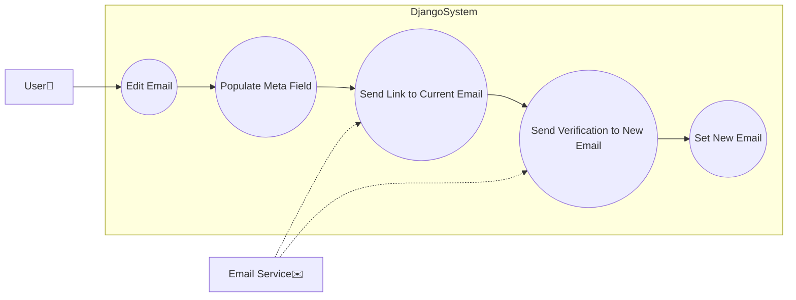

```mermaid
flowchart LR
    subgraph DjangoSystem
    EditEmail((Edit Email))
    PopulateMeta((Populate Meta Field))
    SendLinkCurrent((Send Link to Current Email))
    SendLinkNew((Send Verification to New Email))
    SetNewEmail((Set New Email))
    end

    user[User👤]
    email_service[Email Service✉️]

    user --> EditEmail
    EditEmail --> PopulateMeta
    PopulateMeta --> SendLinkCurrent
    SendLinkCurrent --> SendLinkNew
    SendLinkNew --> SetNewEmail

    email_service -.-> SendLinkCurrent
    email_service -.-> SendLinkNew

```