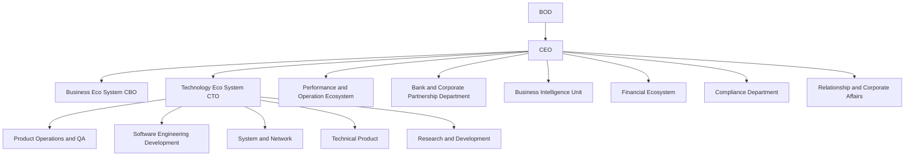

```mermaid
%%{ init: {  font-size: 29px; }}%%
graph TD
    A[BOD] --> B[CEO]
    B --> C[Business Eco System CBO]
    B --> D[Technology Eco System CTO]
    D --> E[Product Operations and QA]
    D --> F[Software Engineering Development]
    D --> G[System and Network]
    D --> H[Technical Product]
    D --> I[Research and Development]
    B --> J[Performance and Operation Ecosystem]
    B --> K[Bank and Corporate Partnership Department]
    B --> L[Business Intelligence Unit]
    B --> M[Financial Ecosystem]
    B --> N[Compliance Department]
    B --> O[Relationship and Corporate Affairs]
```